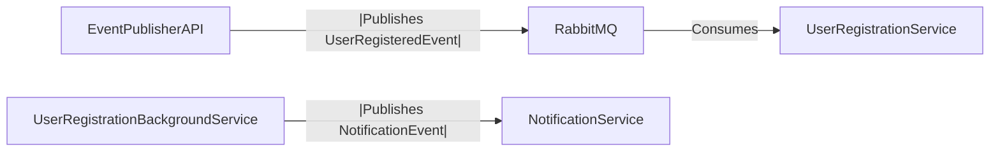

# Event-Driven Architecture - User Registration Flow

This project demonstrates an **Event-Driven Architecture** using **.NET Core** and **RabbitMQ**.

It consists of:

- **EventPublisherAPI**: Publishes `UserRegisteredEvent`.
- **UserRegistrationService**: Consumes the event and triggers further workflows.
- **NotificationService**: Sends notifications based on new user registration events.

---

## Architecture Overview



---

## Project Structure

| Project | Description |
|:---|:---|
| **EventPublisherAPI** | ASP.NET Core Web API to publish `UserRegisteredEvent` to RabbitMQ. |
| **UserRegistrationService** | .NET Core Worker Service to consume user registration events and process them. |
| **NotificationService** | Service to handle sending email/SMS/push notifications for user registration. |

---

## Basic Flow (Completed)

- `EventPublisherAPI` publishes a `UserRegisteredEvent` to **RabbitMQ**.
- `UserRegistrationService` listens to the **UserRegisteredEvent** queue.
- After successful processing, it publishes a **NotificationEvent** to a different RabbitMQ exchange.
- `NotificationService` consumes **NotificationEvent** and sends the actual notification.

---

## Setup Instructions

### Prerequisites
- [.NET 8 SDK](https://dotnet.microsoft.com/download/dotnet/8.0)
- [Docker](https://www.docker.com/) (for RabbitMQ container)
- RabbitMQ Management Plugin enabled

### Running RabbitMQ using Docker

```bash
docker run -d --hostname rabbitmq --name rabbitmq -p 5672:5672 -p 15672:15672 rabbitmq:3-management
```

- RabbitMQ UI will be available at: http://localhost:15672
- Default username/password: `guest/guest`

### Running the Projects

1. Start **RabbitMQ** using Docker.
2. Run `EventPublisherAPI`.
3. Run `UserRegistrationService`.
4. Run `NotificationService`.

---

## Technologies Used

- ASP.NET Core Web API
- .NET Core Worker Service
- RabbitMQ
- MassTransit (optional for abstraction)
- Polly (planned for retry policies)

---

## Things To Do (Upcoming Enhancements)

| Feature | Description |
|:---|:---|
| **Dead Letter Queue (DLQ)** | Configure DLQ in RabbitMQ for failed events that cannot be processed after max retries. |
| **Retry Mechanism** | Implement retry logic using `Polly` or built-in RabbitMQ retries with exponential backoff. |
| **Failure Alerting** | Send an alert (email, Slack, Teams) when a message consistently fails and moves to DLQ. |

---

## Example: UserRegisteredEvent

```csharp
public class UserRegisteredEvent
{
    public Guid UserId { get; set; }
    public string Email { get; set; }
    public DateTime RegisteredAt { get; set; }
}
```

---

## Suggested Improvements

- Add health checks to APIs and Background Services.
- Use correlation IDs for tracing events across services.
- Implement distributed logging and monitoring (e.g., Seq, Grafana, Prometheus).

---

## License

This project is licensed under the MIT License.
